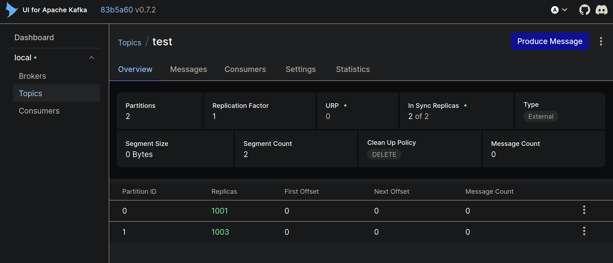
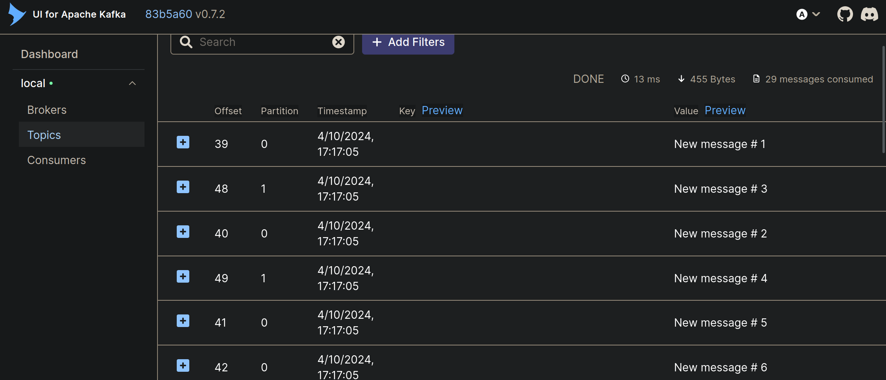

Learning Kafka
==============

# What is Kafka?
Kafka is an open-source distributed event store and streaming platform

Underlying technology: Java + Scala

Maintainer: Apache Software Foundation. Originally created by LinkedIn. Open sourced in 2011

# Why use it?
It's useful for real-time or micro-batched streamed data
1. Scalability. Data can be split across multiple servers, so more data can be stored than by one server alone
2. Fault-tolerance. If one server fails, the data is not lost as it is replicated on other servers in the Kafka pool
3. It's fast

# Set up
1. Install Docker
2. Download and install Kafka for your system and Scala version `https://kafka.apache.org/downloads`
3. Clone this repository
4. Open `docker-compose.yml` and change `KAFKA_ADVERTISED_HOST_NAME` to the public IP of the machine running Kafka (or localhost if running locally)
5. Install python requirements `python3 -m pip install -r requirements.txt`

Kafka will run on port 9092, check that this port is open and not blocked by a firewall

## Running
1. Start the Kafka instance `docker-compose up -d`
2. Add more workers `docker-compose up --scale kafka=3 -d`
3. Access the Kafka web interface via `{PUBLIC_IP}:8080`

You can add topics with the python application by running 
`python3 admin.py create -n "a_new_topic"`

You can remove topics 
`python3 admin.py delete -n "a_new_topic"`

`producer.py` will send 30 messages in the topic `test`, putting odd-numbered messages into partition 0 and even messages into partition 1

`consumer.py` will read messages coming in the topic `test`
